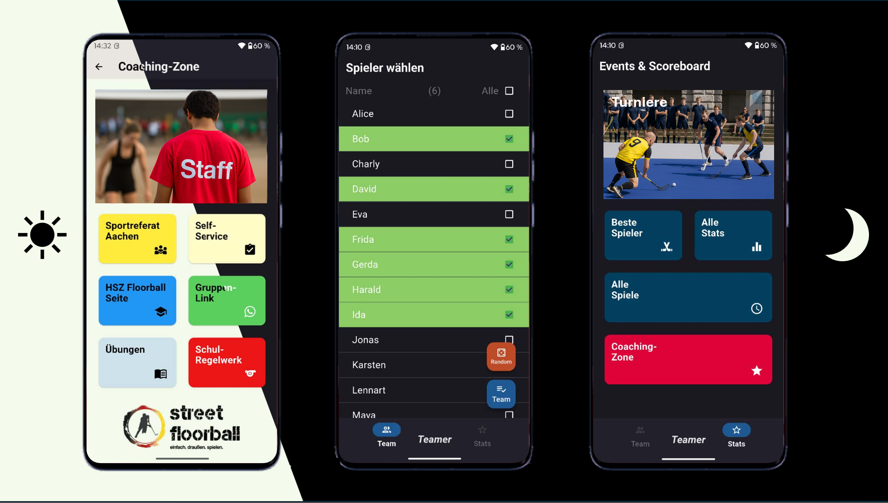

# Teamer 🎉

_Eine Teameinteilungsapp für Spielbetriebe in der Schule oder im Verein_

**Teamer** ist eine Flutter-App, die entwickelt wurde, um faire Teams für Spiele zu bilden. 🏆  
Dabei werden gespeicherte Spielergebnisse berücksichtigt, sodass über die Zeit hinweg alle Teilnehmenden gleich häufig gewinnen.  
Die App unterstützt **Light- und Darkmode** 🌞🌙 und ermöglicht es, Spiele zu speichern und darauf basierend automatisch optimale Teams zu erstellen.

## ✅ Vorteile

- Teams mit **einem Klick** statt manuellem Einteilen ⚡  
- Faire Gewinnchancen für alle dank ausbalancierter Teams ⚖️  
- Spielerentwicklungen und Statistiken im Blick behalten 📈  
- Spiele und Ergebnisse dauerhaft speichern 🗂️  
- Light- & Darkmode verfügbar 🌞🌙  
- Funktioniert flexibel für Gruppen bis **20 Personen** 👥  
- Spart Zeit im Schul- und Vereinsbetrieb ⏱️  
- Steigert den Spaß durch ausgewogene Teams 🎮 

## 📲 Download

[App Release APK herunterladen](https://github.com/fohmij/teamer_flutter/releases/tag/v0.1.0)

---

## ⚙️ Funktionsweise der Teameinteilung

Die Bildung der Teams erfolgt auf Basis der **historischen Winrates** der Spieler:innen.  
Um möglichst faire Teams zu generieren, wird das **Partition Problem** mithilfe eines **Brute-Force-Ansatzes** gelöst. Dabei werden alle möglichen Permutationen durchlaufen, in denen die Teams sowohl hinsichtlich der **Anzahl der Teilnehmenden** als auch der **durchschnittlichen Winrates** möglichst ausgeglichen sind.  

Das Ziel ist es, die minimale Differenz zwischen den durchschnittlichen Winrates der Teams zu finden.  
So können Teams mit bis zu **20 Personen** optimal eingeteilt werden. 👥👥

---

# English

_A team assignment app for school and club gaming activities_

**Teamer** is a Flutter app designed to create fair teams for games. 🏆  
It takes stored match results into account so that, over time, all participants have an equal chance of winning.  
The app supports **light and dark mode** 🌞🌙 and allows saving games to automatically generate optimal teams.

---

### ⚙️ How Team Assignment Works

Teams are formed based on the **historical win rates** of the players.  
To generate the fairest teams possible, the **partition problem** is solved using a **brute-force approach**. All possible permutations are evaluated where the teams are as balanced as possible both in terms of **number of participants** and **average win rates**.  

The goal is to minimize the difference between the average win rates of the teams.  
This way, teams with up to **20 people** can be optimally divided. 👥👥
